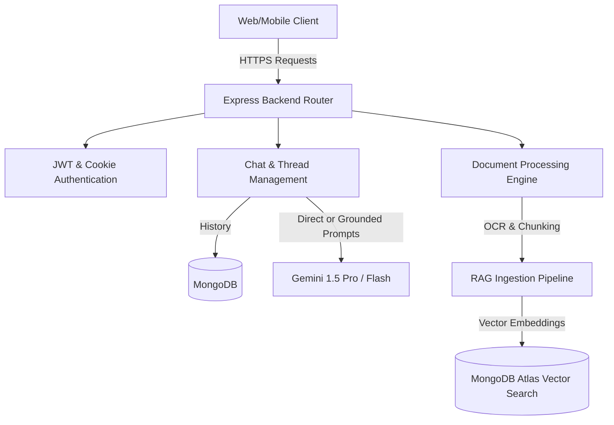
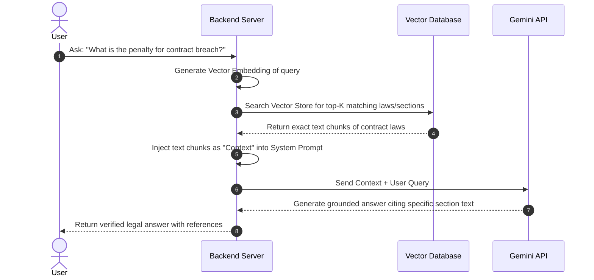

# Roadmap: LawGPT - Personal Lawyer AI Platform

This document outlines a super-detailed, step-by-step engineering and product roadmap to build **LawGPT**, a premium AI-driven legal consultation and analysis platform. The roadmap is structured to take you from a basic LLM chat interface to an advanced, grounded Legal RAG pipeline and Document Analysis engine.

---

## 🏗️ System Architecture Vision

To support a seamless, secure, and production-grade platform, the system should follow a modern, decoupled architecture:



---

## 🎯 Phase 1: Basic AI Chat Platform (LLM-Direct Integration)
**Goal:** Create a functional, multi-turn conversational interface where users can consult the AI on legal questions. The AI replies using Gemini's general knowledge formatted as professional, well-structured legal answers.

### 1. Database Schema Extensions (Mongoose)
To support conversations, you need to store chat history so that the LLM remembers context. Create two key schemas in MongoDB:

* **Chat Session Schema (`ChatSession`)**
  * `userId`: MongoDB ObjectId (references the authenticated user).
  * `title`: String (auto-generated from the first message, e.g., "Landlord Dispute Consultation").
  * `status`: Enum (`active`, `archived`).
  * `timestamps`: Created & Updated dates.
* **Message Schema (`Message`)**
  * `sessionId`: ObjectId (references the corresponding `ChatSession`).
  * `sender`: Enum (`user`, `assistant`).
  * `content`: String (the markdown-formatted text).
  * `tokenCount`: Optional Number (to track LLM cost and billing).
  * `timestamps`: Created date.

### 2. Backend Route Architecture
Create a new router file `chat.routes.js` mounted at `/api/chat` protected by your `authMiddleware`:
* `POST /api/chat/new`
  * Initializes a new `ChatSession` and returns the session ID.
* `GET /api/chat/sessions`
  * Retrieves all past chat sessions belonging to the logged-in user (ordered by last updated).
* `GET /api/chat/sessions/:sessionId`
  * Retrieves all messages inside a specific session to load the conversation history.
* `POST /api/chat/sessions/:sessionId/message`
  * Receives the user's message body.
  * Fetches the last *N* messages from the database to supply context to the LLM.
  * Calls the Gemini API using the official SDK, sending the context + the new message.
  * Saves both the user's message and the Gemini response to the `Message` collection.
  * Returns the markdown response.
* `DELETE /api/chat/sessions/:sessionId`
  * Deletes or archives the conversation session.

### 3. Gemini System Prompt & Persona Design
To make Gemini act like a highly qualified, professional lawyer, you must instantiate the model with strong **System Instructions**. Your system instructions must enforce:
* **Professional Persona:** Speak objectively, structured, and authoritatively.
* **Citation Rule:** When discussing a legal issue, explicitly look up and quote relevant Acts, Sections, and articles (e.g., *"Under Section 302 of the Indian Penal Code..."*).
* **Clear Formatting:** Structure responses using bold headers, bulleted lists, and step-by-step logic.
* **Legal Disclaimer (Critical):** Every consultation session must display or append a clear notice stating: *"I am an AI assistant, not a human lawyer. This represents general legal information, not formal attorney-client advice."*

---

## 🔍 Phase 2: Grounded Legal RAG Pipeline (No Hallucinations)
**Goal:** Connect the chatbot to a local, trusted database of official government legal codes, statutes, and precedent cases. This ensures that the AI answers *only* using exact, verified laws rather than speculating.



### 1. The Legal Data Ingestion Pipeline (Off-line or Cron Job)
* **Resource Collection:** Gather PDF, HTML, or JSON versions of official constitutions, penal codes, and specific state/federal laws.
* **Document Parsing:** Use tools like `pdf-parse` or structured parser libraries to read text from files.
* **Advanced Text Chunking:**
  * Simple character chunking breaks legal clauses in half. Use **Hierarchical or Semantic Chunking**.
  * Keep entire paragraphs or sections together.
  * **Overlap:** Set an overlap of 150-200 characters between chunks to prevent key context from being lost.
* **Metadata Attachment:** Every chunk must retain metadata:
  * `act_name`: e.g., "Indian Penal Code, 1860" or "California Civil Code".
  * `section_number`: e.g., "Section 420" or "Section 1549".
  * `chapter`: The chapter title.

### 2. Embeddings & Vector Database
* **Embedding Model:** Use Google's `text-embedding-004` (via the Gemini package) to transform your text chunks into 768-dimensional vector floats.
* **Vector Store Integration:**
  * **MongoDB Atlas Vector Search:** Recommended as it uses your existing database cluster. You create an Atlas Search Index specifying the vector fields.
  * **Qdrant or Pinecone:** Excellent alternative dedicated vector databases if database size scales past standard MongoDB memory limits.

### 3. Context Retrieval & Prompt Augmentation
When a user asks a question:
1. Generate the vector embedding of the user's message.
2. Query MongoDB's `$vectorSearch` aggregation stage to fetch the top 3-5 most similar legal sections.
3. Construct a grounded prompt template:
   ```text
   You are an expert AI lawyer. Answer the user's question using ONLY the provided verified legal context. If the answer cannot be found in the context, state that you do not have that specific statute in your database. Always cite the Source, Act, and Section Number from the context.
   
   ---
   [VERIFIED LEGAL CONTEXT]
   Source: IPC Section 420
   Text: [Official text of section 420]
   ---
   
   User Question: [User's actual question]
   ```
4. Feed this augmented prompt to Gemini to get a precise, hallucination-free response.

---

## 📄 Phase 3: Legal Document Scanner & Analyzer
**Goal:** Allow users to upload full contracts, NDAs, lease agreements, or legal notices, and have the AI summarize the documents, score their safety/risk, and flags unfavorable clauses.

### 1. Document Upload & Parsing System
* **File Upload Route:** `POST /api/documents/upload` using `multer` middleware. Files are stored securely on a cloud drive (like AWS S3 or Supabase Storage) and marked with database records (`Document` schema).
* **Text Extraction (OCR):**
  * **Standard PDFs/Word Docs:** Parse using `mammoth` (for `.docx` files) or `pdf-parse` (for text-based PDFs).
  * **Scanned/Image-based PDFs:** Integrate an OCR tool like Google Cloud Document AI, AWS Textract, or a local `tesseract.js` worker.

### 2. Contract Review & Summarization Pipeline
* **Chunk-based Summarization:** If a contract is 30 pages long, it will exceed typical context limits. Slice the document into logical sections (e.g., "Definitions", "Termination", "Indemnification") and summarize them iteratively.
* **Risk Scorer Prompting:**
  Pass specific clauses to Gemini alongside a rigorous auditing prompt:
  * **Favorable check:** "Identify clauses that are highly one-sided (e.g. landlord has all rights, tenant has all liabilities)."
  * **Obligation highlighting:** "Extract all critical deadlines, payment terms, and notice periods."
  * **Risk Score:** Assign a score from 1-100 (Safe to High Risk) with a summary explanation.

### 3. Comparison Engine
* Provide a comparative feature where the user uploads a signed agreement, and you compare it clause-by-clause against a "Standard Fair Template". Gemini highlights any deviations or modified wording.

---

## 🚀 Phase 4: Production Polish & Scale

### 1. Frontend UX/UI (Stunning Modern Layout)
To ensure the interface matches the premium nature of the application, follow these guidelines:
* **Glassmorphic Layout:** Use dynamic gradient backdrops, sleek blur panels (`backdrop-filter: blur(16px)`), and thin glowing borders for chat bubbles.
* **Visual Hierarchy:** Distinct sidebars for chat threads history, active status displays, and a main conversational area with smooth transitions using modern CSS properties or Framer Motion.
* **Legal Helper Panel:** A split screen showing the active chat thread on the left, and a sliding reference cards container on the right displaying the official law text cited by the AI.

### 2. Security & Compliance
* **Encrypted Storage:** Ensure uploaded documents are encrypted at rest.
* **Automatic PII Redaction:** Implement a preprocessing step in the backend (using basic regex or a light NLP classifier) to strip sensitive personally identifiable information (PII) like SSNs, Credit Cards, or exact address strings before sending context to public LLMs.

### 3. Session and Rate Limiting
* Protect endpoints against expensive LLM queries using `express-rate-limit`.
* Cache common legal document lookups in Redis to eliminate database search lag.
