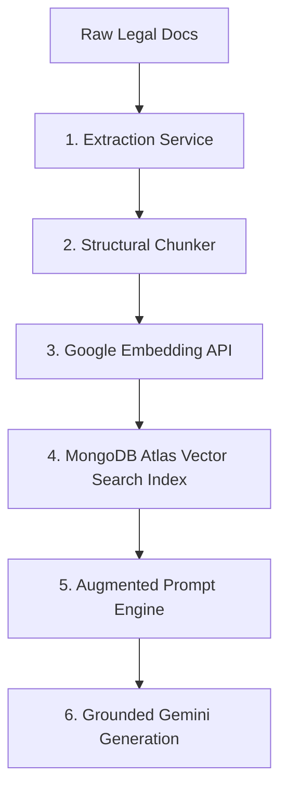

# Phase 2 Implementation Plan: Grounded Legal RAG Pipeline

This document provides a highly detailed, step-by-step engineering specification for implementing the **Grounded Legal RAG Pipeline** (Phase 2) for LawGPT. This plan focuses strictly on structural architecture, steps, and system designs, without containing code, to ensure a clean, concept-first implementation.

---

## 🏛️ 1. Technical Architecture & File Structure

To integrate the RAG pipeline cleanly into your existing backend, organize your components under the following folder structure:

```text
backend/
├── data/
│   └── raw_laws/                 # Directory containing raw legal documents (PDFs, JSONs)
└── src/
    ├── models/
    │   └── legalChunk.model.js    # Mongoose Schema for stored vector chunks
    ├── services/
    │   ├── documentParser.js      # Raw text extraction & clean-up
    │   ├── chunker.js             # Semantic & structural text chunking logic
    │   ├── embedding.js           # Interface for Google text-embedding-004
    │   └── vectorSearch.js        # MongoDB `$vectorSearch` query service
    ├── pipelines/
    │   └── ingest.js              # Orchestrator script to parse, chunk, embed, & save
    └── controllers/
        └── ragChat.controller.js  # Grounded query processing endpoint
```

---

## 📂 2. Detailed Step-by-Step Implementation Flow



### Step 1: Document Gathering & Ingestion Entry point
1. **Raw Directory Preparation:** Establish a local `/backend/data/raw_laws/` folder to host standard legal PDFs (e.g., Indian Penal Code, Landlord-Tenant Acts, California Civil Code).
2. **Metadata Cataloging:** Design a JSON manifest file (`laws_catalog.json`) that maps files to their canonical details. Every file should have associated attributes:
   * Unique ID (e.g., `ipc_1860`)
   * Official Title
   * Jurisdiction (e.g., State/Federal/Country)
   * Publication Date / Version

### Step 2: Document Parsing & Text Cleaning
1. **Parsing Engine Configuration:** Configure `pdf-parse` (or a similar robust stream parser) to read the documents sequentially page-by-page.
2. **Text Normalization:** Implement string sanitization rules to clean the extracted raw text before chunking:
   * Strip repeating header margins, page numbering strings, and recurring footers.
   * Consolidate erratic spaces, line-breaks, and carriage returns into single spaces.
   * Retain structural dividers like paragraph marks (`¶`) or double line-breaks before section headings, as these are critical cues for structural chunking.
3. **Exception Management:** Design handlers for scanned, text-less documents (triggering an alert or routing to OCR tools) and handling encrypted PDF alerts cleanly.

### Step 3: Structural & Semantic Chunking Strategy
Traditional character-based chunking breaks legal clauses, rendering vectors contextually incomplete. Implement a **Section-Aware Chunking Strategy**:
1. **Boundary Recognition:** Utilize regular expressions or boundary splitters aligned to legal documents to split text at major headers (e.g., `"Section [0-9]+"`, `"Article [0-9]+"`).
2. **Logical Chunk Sizes:** Aim for a target block length of **800–1200 characters**.
3. **Sliding Overlap:** Apply a sliding-window overlap of **150–200 characters** only when a single legal section is too long and must span multiple vector records. This guarantees that sentences crossing chunk lines do not lose semantic connection.
4. **Metadata Augmentation:** Embed contextual tags directly into the Mongoose schema for each chunk:
   * `actName` (e.g., "Indian Penal Code, 1860")
   * `sectionNumber` (e.g., "Section 420")
   * `chapterName` (e.g., "Of Cheating")
   * `chunkIndex` (for ordering multi-part sections)

### Step 4: Vector Embeddings Generation
1. **Embedding API Selection:** Utilize Google's standard `text-embedding-004` model.
2. **Contextual Text Formatting:** Before calling the embedding API, prefix the text content with metadata to make the vector representation incredibly dense and searchable. For example:
   * Format: `Act: [Act Name], Chapter: [Chapter Name], Section: [Section Number] - Content: [Chunk Content]`
3. **API Rate Limit Guardrails:**
   * Implement **Batch Processing** to group requests in groups of 10 to 15 text elements, avoiding raw API loops.
   * Set up an **Exponential Backoff Retry Mechanism** to elegantly recover from `429 Too Many Requests` API errors.

### Step 5: Database Setup & MongoDB Atlas Search Index
1. **Mongoose Schema Design:** Define a `LegalChunk` database collection:
   * Fields: `actName` (String), `sectionNumber` (String), `chapterName` (String), `content` (String), `embedding` (Array of Floats, size 768), and a `createdAt` timestamp index.
2. **Create Atlas Vector Search Index:**
   Configure a Search Index on your MongoDB Atlas collection using the following JSON definition:
   ```json
   {
     "fields": [
       {
         "type": "vector",
         "path": "embedding",
         "numDimensions": 768,
         "similarity": "cosine"
       }
     ]
   }
   ```
3. **Data Verification:** Write a validation check that runs after indexing to verify the total uploaded count matches the parsed sections count, and confirm that all vector fields are populated.

### Step 6: Context Retrieval Engine (The RAG query service)
1. **Query Embedding:** When a user inputs a query, route it through the exact same `text-embedding-004` model to generate a 768-dimensional search vector.
2. **Atlas `$vectorSearch` Aggregation:**
   Construct a MongoDB aggregation pipeline:
   * Use `$vectorSearch` targeting your index path and supply the query vector.
   * Request the `top 3 to 5` matching documents.
   * Specify candidates parameters (`numCandidates: 100`) to increase search precision.
3. **Relevance Filtering (Similarity Threshold):** Extract the search score returned by Atlas and discard any results scoring below a specific relevance score (e.g., lower than `0.65`) to ensure completely unrelated legal sections are not injected.

### Step 7: Prompt Augmentation & Grounded Gemini Generation
1. **Context Structuring:** Construct a markdown-formatted payload enclosing the retrieved chunks:
   ```text
   You are a highly analytical AI Legal Advisor. Answer the user's query utilizing ONLY the verified legal chunks provided in the Context block.
   
   Strict Compliance Rules:
   1. If the provided context does not contain sufficient details to answer, state clearly: "I cannot find this specific law in my legal database."
   2. Do not hallucinate, extrapolate, or assume laws not specifically written in the context.
   3. For every claim or statement, cite the corresponding Act and Section numbers.
   
   ---
   [VERIFIED LEGAL CONTEXT]
   Source: California Civil Code - Section 1549 (Agreement)
   Text: "An agreement is an act of covenant..."
   ---
   
   User Question: [Insert User Query Here]
   ```
2. **Multi-Turn Context Safety:** Since legal prompts scale up rapidly, only pass the last **3-5 messages** of conversation history alongside the freshly retrieved RAG context.
3. **UI Integration & Citation Mapping:** Return not just the text response from Gemini, but also a secondary structured payload containing the `sources` array (Act, Section, Text) to the frontend, enabling the UI to highlight cited sections in a clean side-panel interface.

---

## 🧪 3. Verification & Evaluation Protocol

To ensure the RAG pipeline is accurate, safe, and hallucination-free:

1. **Golden Query QA Set:** Assemble a list of 15 standard, target legal questions (some covered in the raw laws and some completely outside their scope).
2. **Recall Test:** Run search queries and verify if the correct matching database records appear in the top 3 items returned by MongoDB.
3. **Negative Test:** Verify that questions about laws *not* in the raw database trigger the expected *"I cannot find this specific law in my legal database"* fallback response instead of standard LLM training data.
